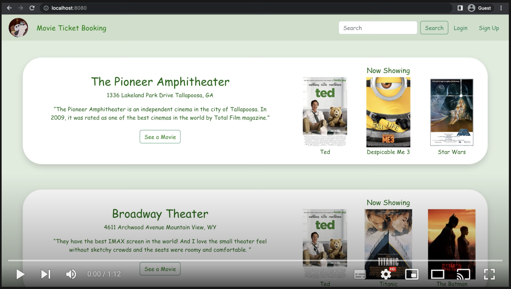

## Online Movie Ticket Booking Platform
This project constructs an online movie ticket booking website. 
The platform currently supports browsing movie information of movie theaters and movies, 
and ticket reservation and cancellation services for registered users. Here is a [demo video](https://youtu.be/7e6kLWGN-fA) about this platform.
### Languages/Frameworks

#### [Frontend](frontend)
- HTML/CSS
- JavaScript
- React
- Bootstrap
- Redux Toolkit

#### [Backend](backend)
- Java
- Spring Boot
- Spring Security
- H2 Database

#### Configuration and Integration
- Maven
- Thymeleaf

### Build and Run the Project
Open a terminal at the current folder and execute 

`sh build.sh`

The application will be launched at [http://localhost:8080](http://localhost:8080). With the script build.sh, frontend and backend application are integrated together, which means frontend and backend applications will share the port 8080. To build and run [frontend](frontend) and [backend](backend) parts separately, please refer to the corresponding subdirectories.

### Current Features
1. Display movie theater information and the corresponding movies shown in the theater.
2. Platform member registration and login.
3. Support movie tickets reservation and cancellation for registered members only. 

### Demo Video

### ToDo
- [ ] Enable searchbar function
- [ ] Add calendar to booking system
- [ ] Deploy on a Cloud platform
