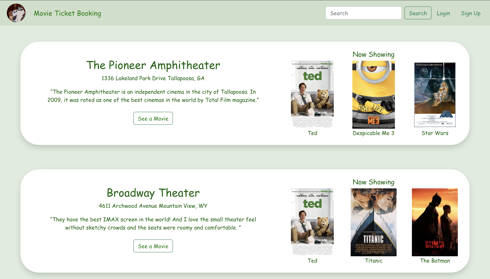
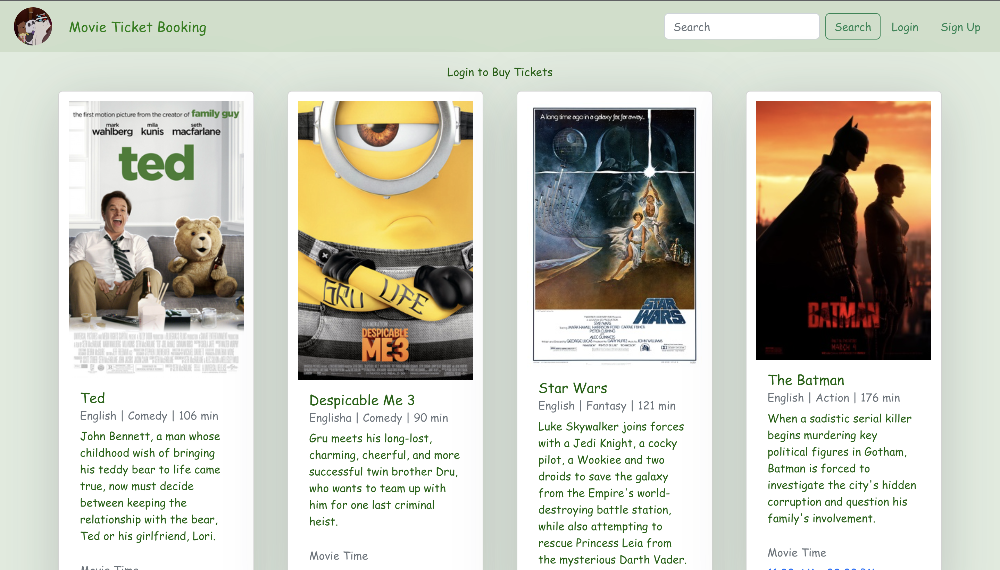
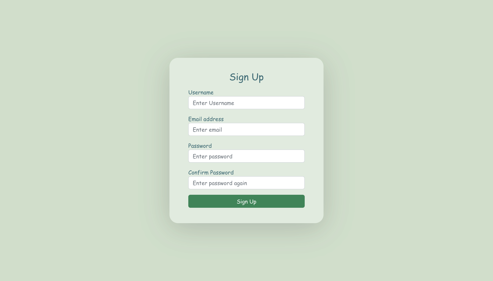
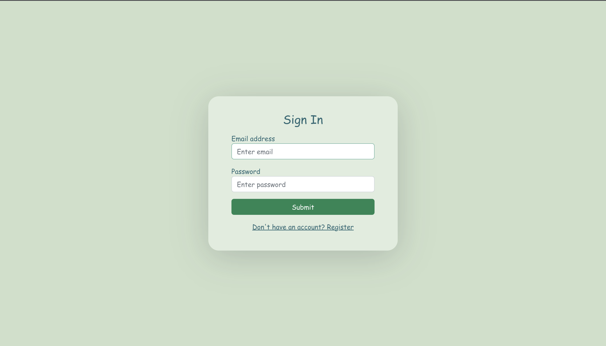
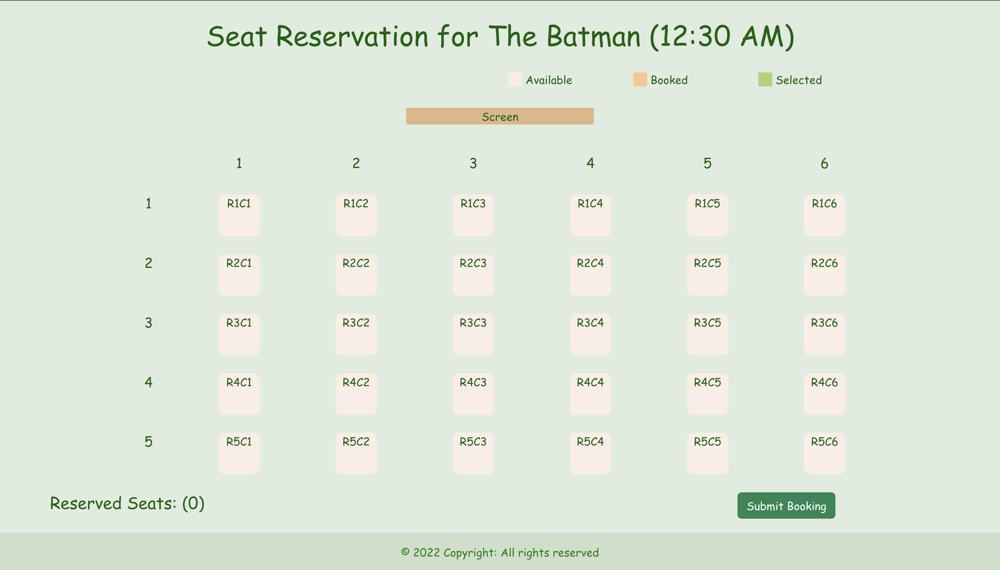
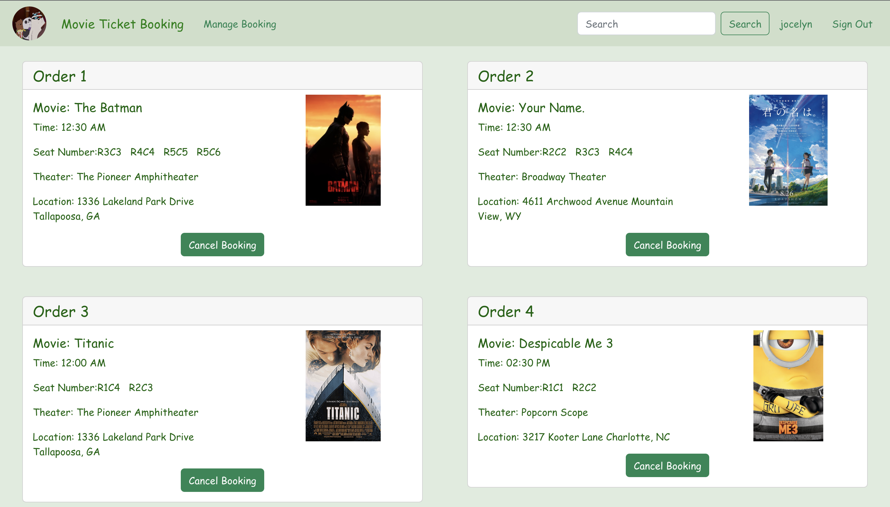

## Frontend Application
This is the frontend implementation of ***Online Movie Ticket Booking Platform***. For the backend implementation, please refer [here](../backend).

### Languages/Frameworks
- HTML/CSS
- JavaScript
- React
- Bootstrap
- Redux Toolkit

### Build and Run
The frontend application is built based on React, and it can be built and debugged in the exact way like any other React applications.

To install required packages, run

`npm install`

To build the frontend application, under *frontend* subdirectory run

`npm run build`

To start the application on [http://localhost:3000](http://localhost:3000), under *frontend* subdirectory run

`npm start`

Note that starting frontend app only gives you an outline of the website. To load the webpage contents (such as theater and movie information), please run the backend server along with the frontend app. 

### User Interface
| Movie Theater List                             | Movie List                              |
|------------------------------------------------|-----------------------------------------|
|   |  |

| User Registration Page                    | User Login Page                     |
|-------------------------------------------|-------------------------------------|
|  |  |

| Ticket Booking                              | Booking Management                            |
|---------------------------------------------|-----------------------------------------------|
|  |  |

### Reference
- https://github.com/ganeshmani/redux-toolkit-user-flow
